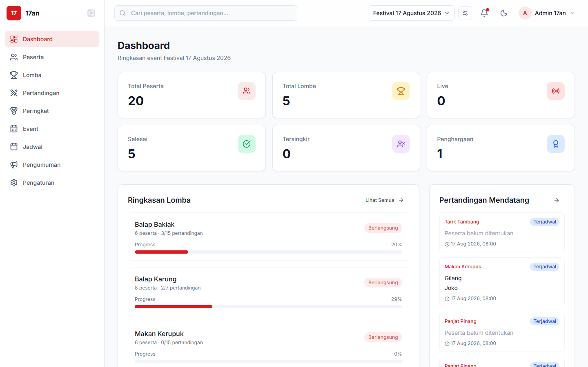
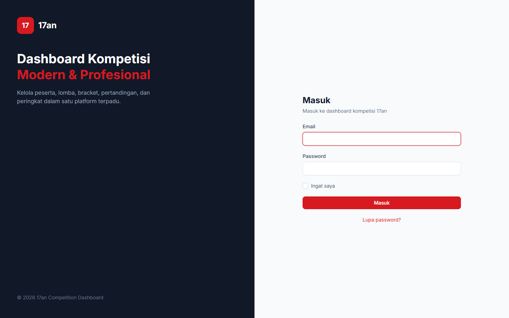
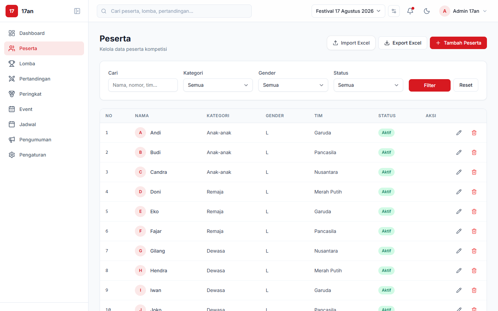
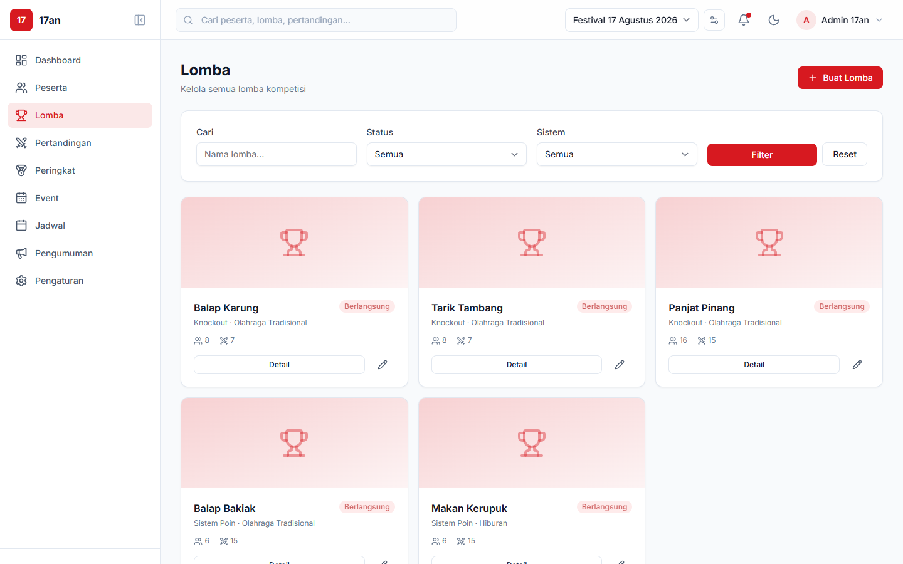
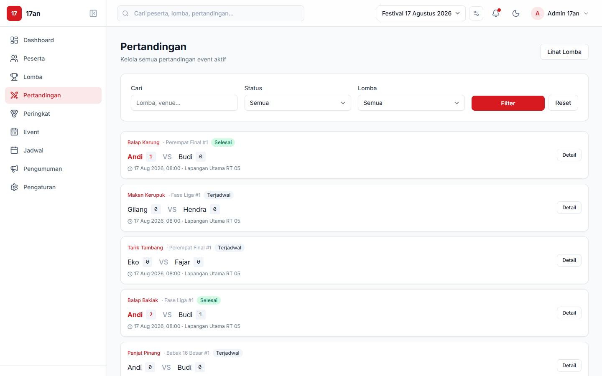
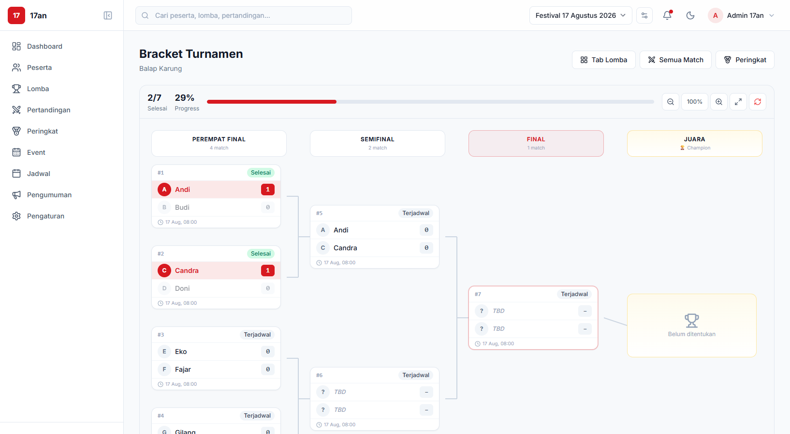
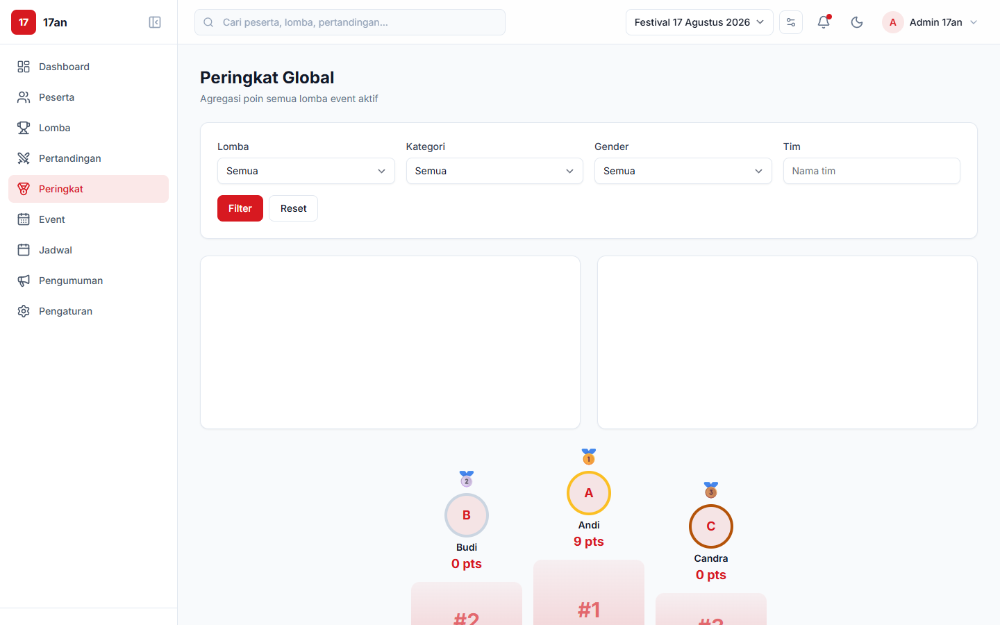
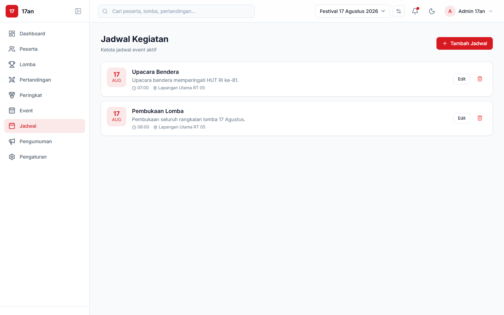

# 17an Competition Dashboard

> Modern tournament management platform untuk mengelola lomba 17 Agustus — peserta, lomba, bracket knockout, sistem poin, ranking, dan jadwal dalam satu dashboard.



## Tech Stack

| Layer | Teknologi |
|-------|-----------|
| Backend | Laravel 13 + PHP 8.x |
| Database | MySQL 8 |
| Frontend | Blade + Tailwind CSS + Alpine.js |
| Icons | Lucide Icons |
| Charts | Chart.js |
| Import/Export | maatwebsite/excel |

## Screenshots

### Login



### Dashboard

Statistik overview, ringkasan lomba, dan pertandingan mendatang.


### Peserta

CRUD peserta dengan filter, search, import/export Excel.



### Lomba

Card view semua lomba dengan status, sistem pertandingan, dan jumlah peserta.



### Pertandingan

Daftar semua pertandingan dari semua lomba dengan filter status.



### Bracket Turnamen

Visualisasi bracket knockout dengan auto-advance winner ke ronde berikutnya.



### Peringkat Global

Agregasi poin seluruh lomba dengan podium visual dan leaderboard.



### Jadwal Kegiatan

Manajemen jadwal event 17 Agustus.



## Fitur Utama

- **Multi-event** — Event selector di topbar, data terpisah per tahun
- **CRUD Peserta** — Import/export Excel, filter kategori/gender/status
- **CRUD Lomba** — Wizard multi-step (info → peserta → sistem → konfigurasi → review)
- **Bracket Knockout** — Visualisasi bracket, input skor, auto-advance winner
- **Sistem Poin** — Konfigurasi poin menang/seri/kalah, ranking otomatis
- **Ranking Global** — Agregasi poin semua lomba, podium visual
- **Pertandingan** — Manajemen match, input hasil, filter status
- **Jadwal & Pengumuman** — Kelola jadwal kegiatan event
- **Dashboard Statistik** — Overview lengkap dengan activity log
- **Dark Mode** — Toggle dark/light mode

## Setup (Laragon)

### 1. Database

Buat database MySQL `17an`.

### 2. Environment

File `.env` sudah dikonfigurasi:

```
APP_URL=http://17an.test
DB_DATABASE=17an
DB_USERNAME=root
DB_PASSWORD=
```

### 3. Install & Migrate

```bash
cd c:\laragon\www\17an
composer install
npm install
php artisan migrate:fresh --seed
php artisan storage:link
npm run build
```

### 4. Akses

- **http://17an.test** (jika Laragon auto virtual host aktif)
- atau `php artisan serve` → http://localhost:8000

## Login

| Field | Value |
|-------|-------|
| Email | admin@17an.test |
| Password | password |

## Dummy Data (Seeder)

- 2 events (2025 selesai, 2026 aktif)
- 20 peserta dengan kategori anak-anak, remaja, dewasa
- 5 lomba: Balap Karung, Tarik Tambang, Panjat Pinang (knockout) + Balap Bakiak, Makan Kerupuk (point system)
- Pertandingan & hasil dummy

## Struktur Proyek

```
app/
├── Enums/              # Status enums (CompetitionStatus, MatchStatus, dll)
├── Exports/            # Excel export classes
├── Imports/            # Excel import classes
├── Models/             # Eloquent models + relationships
├── Services/           # Business logic (BracketService, RankingService, dll)
└── Http/Controllers/   # Thin controllers

resources/views/
├── components/ui/      # Reusable UI components (button, card, badge, modal, dll)
├── layouts/            # Admin layout (sidebar + topbar)
├── participants/       # CRUD peserta
├── competitions/       # CRUD lomba + wizard
├── brackets/           # Visualisasi bracket knockout
├── matches/            # Manajemen pertandingan
├── rankings/           # Peringkat global + per lomba
├── schedules/          # Jadwal kegiatan
└── announcements/      # Pengumuman
```

## Development

```bash
npm run dev          # Vite dev server
php artisan serve    # Laravel dev server
```

## Dokumentasi Desain

Lihat `docs/superpowers/specs/2026-08-19-17an-competition-dashboard-design.md`
